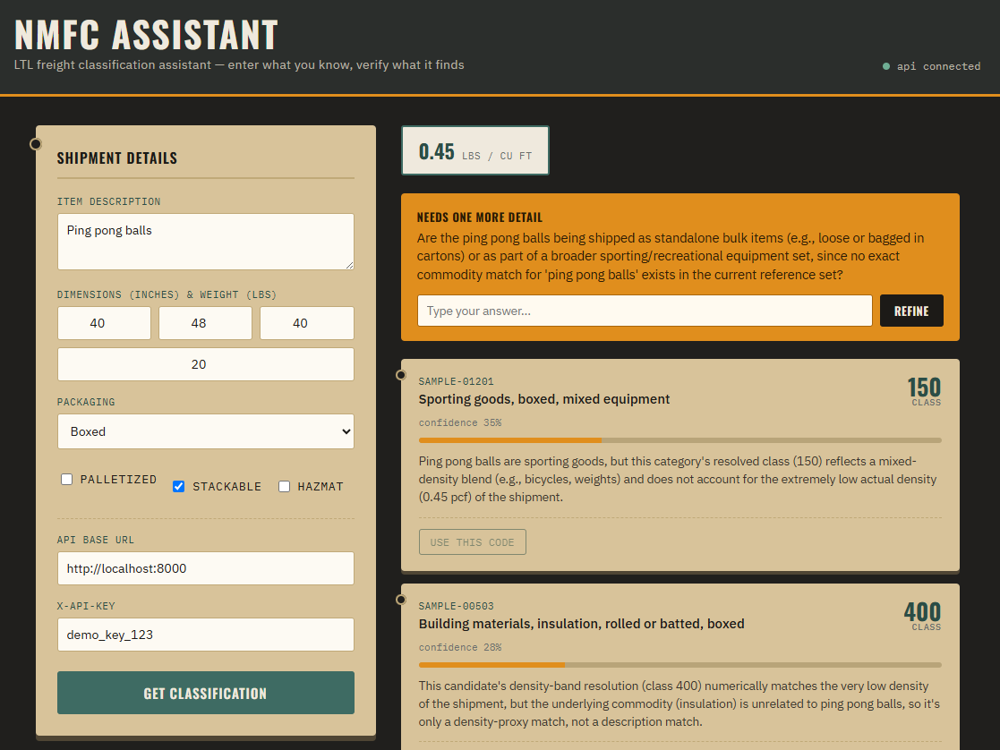

# NMFC Code Assistant

An AI-assisted NMFC freight classification API for 3PL LTL shipping platforms. Given a shipper's raw item description and shipment details, it returns ranked, confidence-scored NMFC code suggestions with plain-English rationale, reducing the misclassification rebills that happen when shippers guess at a code they don't actually know.

**This repo is an API, not an app.** The included `demo.html` is just a wrapper that exercises the API end to end so you can see the classification logic working. The intended integration point is `POST /v1/nmfc/suggest`, meant to be embedded directly into a brokerage's existing shipment-order flow as a required-field assist, with the brokerage's own UI calling this endpoint instead of the demo shown here.

**Live API**: `https://nmfc-assistant.onrender.com` - interactive docs at [`/docs`](https://nmfc-assistant.onrender.com/docs). Hosted on Render's free tier, which spins down after inactivity - the first request after idle time can take 30-60 seconds to respond while it wakes back up; subsequent requests are fast.

## The problem

LTL freight class determines the rate a shipment is billed at. Most shippers know their item's dimensions and weight, but hardly anybody knows their item's NMFC code. When the code field is left blank or guessed incorrectly at booking, carriers reclassify and rebill for more money, and shippers also run the risk of shipment delays. It's a huge, expensive headache.

Making NMFC code a required field in a shipping platform closes that gap, but only if getting it right is nearly as fast as leaving it blank. So that's what this API is built to do: minimize funnel friction while still producing a defensible, explainable classification.

## Architecture

Three layers:

```
shipment input
      │
      ▼
┌─────────────────────┐
│ 1. Density calc      │  deterministic math, no AI, no latency cost
│    (density.py)      │  weight ÷ (L×W×H / 1728) = density (pcf)
└─────────┬────────────┘
          ▼
┌─────────────────────┐
│ 2. Semantic retrieval│  embed item description, cosine-similarity
│  (build_embeddings.py)│ search against the commodity reference set
└─────────┬────────────┘
          ▼
┌─────────────────────┐
│ 3. Claude reasoning   │  ranks candidates, scores confidence,
│    (main.py)          │  writes rationale, resolves class per
│                       │  candidate's density table or fixed class
└─────────┬────────────┘
          ▼
  ranked suggestions +
  confidence + rationale
  (+ one clarifying
   question if confidence
   is too low to trust)
```

Density is computed before the LLM ever sees the request, and each candidate's class is already resolved against that density before Claude ranks anything. This keeps class-to-density mapping predictable and testable, and reserves the LLM for matching ambiguous free text to the right commodity, explaining why, and knowing when it doesn't know.

## API

**Request** - `POST /v1/nmfc/suggest`
```json
{
  "description": "wooden dining table, unassembled, in cardboard box",
  "length_in": 48, "width_in": 30, "height_in": 12, "weight_lbs": 65,
  "packaging": "boxed", "palletized": false, "stackable": true, "hazmat": false
}
```

**Response**
```json
{
  "computed_density_pcf": 6.5,
  "suggestions": [
    {
      "nmfc_item_id": "SAMPLE-00101",
      "commodity_description": "Furniture, wooden, unassembled, boxed",
      "suggested_class": 100,
      "confidence": 0.88,
      "rationale": "Directly matches the unassembled wooden furniture description; density of 6.5 pcf resolves to class 100.",
      "hazmat_flag": false
    }
  ],
  "needs_clarification": false,
  "clarifying_question": null
}
```

When top confidence falls below ~0.5, `needs_clarification` flips to `true` with exactly one targeted follow-up question. A second call with `clarification_answer` (and `previous_clarifying_question`) set re-ranks using the original description plus the new detail, closing the loop without the caller having to reconstruct anything from scratch.

Full request/response schema is in `main.py`; interactive docs are auto-generated at `/docs` when the API is running (Swagger UI, via FastAPI).

**Reference client, shown for illustration - not the deliverable.** This is `demo.html` exercising the API against an ambiguous test case (a generic "ping pong balls" description with no specific commodity in the reference set). Confidence lands below the threshold on the top match, so retrieval falls back to the nearest general categories rather than forcing a false-confident pick - the actual product surface for a brokerage integration is the JSON response driving this, not this particular interface.



## Key design decisions

- **One clarifying question, max.** Every additional required field before a confident suggestion is available is friction a shipper will abandon. The system asks the single most confidence-improving question and stops.
- **NOI (catch-all) is always the fallback, never the leader.** The reasoning layer is explicitly instructed to deprioritize the generic "Not Otherwise Indicated" commodity below any reasonably-scoring specific match. NOI is truly just used as a last resort to get an NMFC code on there in some way.
- **Hazmat is surfaced, never auto-confirmed.** A hazmat-flagged candidate is still shown and ranked, but the response explicitly notes it requires manual compliance review regardless of confidence score.
- **Deterministic math stays deterministic.** Density-to-class resolution never goes through the LLM, so this legally/financially sensitive calculation stays auditable and unit-testable.
- **The clarification loop is stateless by design.** No session or database is required to close the ask → answer → re-rank cycle; the caller resends the original payload plus the answer. Simpler to integrate into an existing booking flow that may not want to manage conversation state for a single field.

## Running it locally

```bash
python3 -m venv venv && source venv/bin/activate   # Windows: venv\Scripts\activate
pip install sentence-transformers fastapi anthropic uvicorn gspread google-auth
export ANTHROPIC_API_KEY=your_key                  # Windows: set ANTHROPIC_API_KEY=your_key
export NMFC_API_KEY=your_own_demo_key
# optional - see "Data & privacy" below for the override-logging setup:
export GOOGLE_SHEETS_CREDENTIALS_PATH=path/to/your-service-account.json
export GOOGLE_SHEET_ID=your_sheet_id

python build_embeddings.py     # builds the retrieval cache once
uvicorn main:app --reload      # starts the API at localhost:8000
```

Open `demo.html` directly in a browser to exercise the API through the reference client, or hit `/docs` for the interactive Swagger UI, or call `/v1/nmfc/suggest` directly from your own client.

## Data & privacy

The reasoning layer is a bring-your-own-key (BYOK) architecture: `ANTHROPIC_API_KEY` is read from an environment variable at runtime, so whoever actually deploys this - you, or a brokerage running it themselves - controls which Anthropic account is billed and which commercial agreement governs the request. No code changes are needed for a brokerage to run this under their own account rather than the original developer's.

Using a brokerage's own key means their requests run under their own Anthropic commercial terms, but it doesn't change what leaves their infrastructure. Every call to `/v1/nmfc/suggest` sends the item description, computed density, and the matched candidate commodity descriptions to Anthropic's API to get a ranked response back.

Before pointing this at real, licensed NMFTA data, a brokerage's legal/security team should confirm directly with Anthropic:
- Whether their specific account and usage pattern qualifies for zero data retention (ZDR)
- Whether a data processing addendum (DPA) is in place
- Their own commercial API terms around data use and retention, since these are agreement-specific and shouldn't be assumed from general documentation

This project doesn't do anything to change, log, or persist the data sent to Anthropic beyond the request/response cycle itself - the only data this system stores anywhere is the override log described below, which lives in the deploying party's own Google Sheet, not with Anthropic or this codebase's author.

**Override logging** (`sheets_logger.py`) is optional and only activates if `GOOGLE_SHEETS_CREDENTIALS_PATH` and `GOOGLE_SHEET_ID` are set. It appends one row per user selection - the top suggestion, what the user actually picked, and whether that counts as an override - to a Google Sheet you control, via a service account you create and share access with. If those environment variables aren't set, `/v1/nmfc/log-selection` fails gracefully and simply reports that logging didn't happen, without breaking the classification flow.

## Important consideration - data source is make-believe

`sample_nmfc_dataset.json` is a completely made-up, illustrative commodity set built for this demo. It is not the real NMFC tariff. The actual National Motor Freight Classification is copyrighted and licensed through the National Motor Freight Traffic Association (NMFTA); a production deployment of this system would require licensing the full commodity dataset from NMFTA and replacing this file with it. The architecture (density calculator, embedding retrieval, reasoning layer, API contract) is unaffected by that swap - only the data file changes.

## What a real brokerage integration would need beyond this repo

- NMFTA-licensed commodity data in place of the sample set
- Multi-tenant API key management and rate limiting (current auth is a single shared demo key)
- Webhook or SDK wrappers so a brokerage's TMS can call this as a drop-in step in their existing booking flow, rather than the standalone reference UI included here

## Stack

Python, FastAPI, Claude (Anthropic API) for the reasoning layer, `sentence-transformers` for local embeddings, Google Sheets (via `gspread`) for optional override logging, vanilla HTML/CSS/JS for the reference client.
